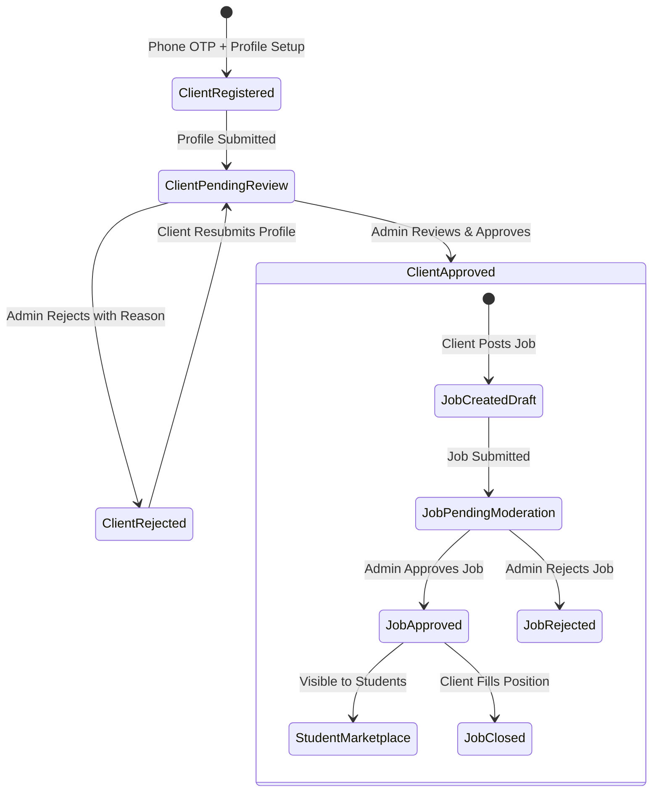
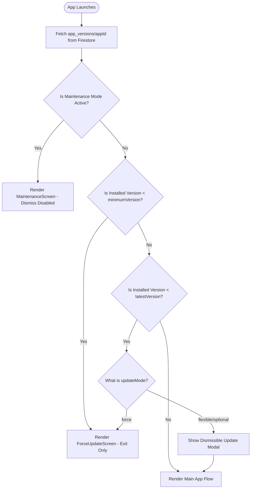

# TECH2PLACE Architecture Guide

This document defines the technical architecture, data contracts, security boundaries, and cross-application workflows powering the TECH2PLACE React Native ecosystem.

---

## 1. High-Level Architecture

```
                             ┌──────────────────────────────────────┐
                             │       Google Firebase Platform       │
                             │  (Auth, Firestore, Cloud Functions, │
                             │      FCM, Storage, Analytics)       │
                             └──────────────────┬───────────────────┘
                                                │
                 ┌──────────────────────────────┼──────────────────────────────┐
                 ▼                              ▼                              ▼
    ┌─────────────────────────┐    ┌─────────────────────────┐    ┌─────────────────────────┐
    │     STUDENT APP         │    │       CLIENT APP        │    │       ADMIN APP         │
    │ (com.tech2place.student)│    │ (com.tech2place.client) │    │  (com.tech2place.admin) │
    │                         │    │                         │    │                         │
    │ • Minor/Major Projects  │    │ • Employer Registration │    │ • Client Verifications  │
    │ • Approved Jobs Board   │    │ • Job Creation & Edit   │    │ • Job Moderation Board  │
    │ • Job Applications      │    │ • Applicant Pipeline    │    │ • User & Staff RBAC     │
    │ • Courses & Enrollment  │    │ • Company Profile       │    │ • App Version Policies  │
    │ • Force Update Gate     │    │ • Approval Status Gate  │    │ • Push Broadcaster      │
    └────────────┬────────────┘    └────────────┬────────────┘    └────────────┬────────────┘
                 │                              │                              │
                 └──────────────────────────────┼──────────────────────────────┘
                                                ▼
                             ┌──────────────────────────────────────┐
                             │          @tech2place/shared          │
                             │  (Types, Utilities, Theme, Services,│
                             │      Design System UI Components)    │
                             └──────────────────────────────────────┘
```

---

## 2. Monorepo Organization

```text
├── admin/                         # Administrative Console (React Native Android)
│   ├── android/                   # Native Android configuration (com.tech2place.admin)
│   ├── src/
│   │   ├── screens/               # Dashboard, Approvals, Users, Versions, Push, Staff, Audit
│   │   ├── services/              # Admin state & API adapters
│   │   └── App.tsx                # App entrypoint with RBAC routing
│   └── package.json
│
├── client/                        # Client / Employer App (React Native Android)
│   ├── android/                   # Native Android configuration (com.tech2place.client)
│   ├── src/
│   │   ├── screens/               # Auth, Profile, Job creation, Applicant management
│   │   ├── services/              # Client API adapters
│   │   └── App.tsx                # App entrypoint with approval state guard
│   └── package.json
│
├── student/                       # Student Mobile App (React Native Android)
│   ├── android/                   # Native Android configuration (com.tech2place.student)
│   ├── src/
│   │   ├── screens/               # Dashboard, Projects, Jobs, Applications, Courses, Profile
│   │   ├── services/              # Student API adapters
│   │   └── App.tsx                # App entrypoint with Force Update guard
│   └── package.json
│
├── shared/                        # Shared TypeScript Library
│   ├── components/                # Reusable cross-platform UI components (Button, Card, Modal, etc.)
│   ├── constants/                 # Collections, Roles, Config
│   ├── services/                  # Version check, Auth, Audit, Notifications, RBAC
│   ├── theme/                     # Brand colors (#026fc7/#0c8ce9), typography, spacing
│   ├── types/                     # Core domain interfaces
│   └── utils/                     # Semver parser, formatters, phone validators, deep linking
│
├── firebase/                      # Production Cloud Configurations
│   ├── firestore.rules            # Security rules with strict RBAC enforcement
│   ├── storage.rules              # Upload constraints (5MB avatar, 10MB attachments)
│   ├── firestore.indexes.json     # Compound query indexes
│   └── functions/                 # TypeScript background triggers & notification dispatch
│
└── tests/                         # Automated unit & integration tests
```

---

## 3. Core Domain Entities

### `User`
```typescript
interface User {
  uid: string;
  phoneNumber: string;
  name: string;
  role: 'student' | 'client' | 'moderator' | 'admin' | 'superuser';
  status: 'active' | 'suspended';
  isApproved: boolean;
  email?: string;
  profileImage?: string;
  createdAt: string;
  updatedAt: string;
}
```

### `Job`
```typescript
interface Job {
  id: string;
  clientId: string;
  clientName: string;
  title: string;
  description: string;
  category: string;
  skills: string[];
  budget: number;
  deadline: string;
  location: string;
  isRemote: boolean;
  jobType: 'Full-time' | 'Part-time' | 'Internship' | 'Contract';
  attachments: string[];
  status: 'pending_approval' | 'approved' | 'rejected' | 'closed';
  approvalStatus: 'pending' | 'approved' | 'rejected';
  rejectionReason?: string;
  approvedBy?: string;
  approvedAt?: string;
  applicationsCount: number;
  createdAt: string;
  updatedAt: string;
}
```

### `AppVersionConfig`
```typescript
interface AppVersionConfig {
  appId: 'student' | 'client' | 'admin';
  latestVersion: string;          // e.g. "1.1.0"
  minimumVersion: string;         // e.g. "1.0.0"
  updateMode: 'force' | 'flexible' | 'optional';
  updateTitle: string;
  updateMessage: string;
  androidStoreUrl: string;
  maintenance: boolean;
  maintenanceMessage?: string;
  enabled: boolean;
  updatedAt: string;
  updatedBy: string;
}
```

---

## 4. Key Workflows & State Machines

### 4.1 Client Verification & Job Posting Pipeline


### 4.2 Semantic Versioning & Force Update Gate


---

## 5. Deep Linking Scheme

All three applications register deep links matching the standard schema:
```text
tech2place://{appId}/{resource}/{id}
```

| Application | Scheme / Host | Target Destinations |
|:---|:---|:---|
| **Student** | `tech2place://student/jobs/:id` | Opens Job Detail screen directly |
| **Student** | `tech2place://student/projects/:id` | Opens Academic Project screen |
| **Client** | `tech2place://client/jobs/:id/applications` | Opens Candidate Review board |
| **Admin** | `tech2place://admin/approvals/clients` | Opens Pending Clients review screen |
| **Admin** | `tech2place://admin/approvals/jobs` | Opens Pending Jobs moderation screen |

---

## 6. In-App Notifications & Broadcast Campaigns

All three mobile applications share a unified notification pipeline configured through `@tech2place/shared`.

### 6.1 Entity Schemas
```typescript
interface AppNotification {
  id: string;
  userId: string;
  title: string;
  body: string;
  imageUrl?: string;
  deepLink?: string;
  read: boolean;
  createdAt: string;
  data?: Record<string, string>;
}

interface NotificationCampaign {
  id: string;
  title: string;
  message: string;
  target: NotificationTarget; // 'all_apps' | 'student_app' | 'client_app' | 'admin_app' | ...
  sentBy: string;
  status: 'sent' | 'scheduled' | 'failed' | 'draft';
  createdAt: string;
}
```

### 6.2 Visual Indicators & Sync
1. **Header Action & Unread Badge**: Both the Student and Client profile screens render a floating notification bell with a dynamic unread counter badge.
2. **Dedicated Notification Screens**:
   - `student/src/screens/notifications/NotificationsScreen.tsx`
   - `client/src/screens/notifications/ClientNotificationsScreen.tsx`
   - `admin/src/screens/notifications/AdminNotificationsScreen.tsx`
3. **Bulk Actions**: Includes instant "Mark all as read" capability with optimistic local state updates and remote persistence.
4. **Interactive Action Links**: Deep links embedded in notifications automatically direct users to specific jobs, verification screens, or profile reviews.

---

## 7. Security Architecture & RBAC Matrix

TECH2PLACE enforces a dual-layer role-based access control (RBAC) model implemented client-side in `RbacService` and server-side in `firestore.rules`.

### 7.1 Role Hierarchy

| Role | Scope | Default Permissions |
|:---|:---|:---|
| **superuser** | System Master | All 39 granular permissions (unrestricted platform governance) |
| **admin** | Platform Administrator | Users, jobs, client verification, versions, notifications, audit logs, categories |
| **staff** | Operations Operator | Job review, reports monitoring, read-only user directory |
| **moderator** | Content Moderator | Job approvals, job rejections, job deletions, abuse reports |
| **support** | Help Desk Support | User lookup, account inspection, notification audit |
| **student** | End User (Candidate) | Browsing approved jobs, project applications, enrollment |
| **client** | End User (Employer) | Posting jobs, reviewing applicants, company profile management |

### 7.2 Core Permission Domains
- **User Management**: `users.view`, `users.edit`, `users.suspend`, `users.search`
- **Client Approvals**: `clients.view`, `clients.approve`, `clients.reject`, `clients.suspend`
- **Job Moderation**: `jobs.view`, `jobs.create`, `jobs.edit`, `jobs.approve`, `jobs.reject`, `jobs.delete`
- **Releases & Governance**: `app_versions.view`, `app_versions.create`, `app_versions.update`, `maintenance.manage`
- **Audit & Security**: `audit_logs.view`, `feature_flags.manage`, `categories.manage`

---

## 8. Native Android Build & Packaging Pipeline

Each application in the monorepo is configured with its own standalone native Android project under `android/`.

### 8.1 Build Specifications
- **React Native Version**: `0.76.7`
- **Gradle Version**: `8.14.3` (via Gradle Wrapper)
- **Android Gradle Plugin (AGP)**: `8.8.0`
- **Kotlin Version**: `2.0.21`
- **Compile SDK**: `35`
- **Min SDK**: `24`
- **Target SDK**: `35`
- **Java Toolchain**: OpenJDK 17 (`/opt/homebrew/Cellar/openjdk@17/17.0.20.1`)

### 8.2 Application Identifiers & Packages

| App Directory | Package Identifier | Display Name |
|:---|:---|:---|
| `student/android/app` | `com.tech2place.student` | **Tech2Place Student** |
| `client/android/app` | `com.tech2place.client` | **Tech2Place Client** |
| `admin/android/app` | `com.tech2place.admin` | **Tech2Place Admin** |

### 8.3 Monorepo Metro Configuration
Metro is configured at the workspace root (`metro.config.js`) to seamlessly bundle cross-package dependencies from `shared/`:
```javascript
const { getDefaultConfig, mergeConfig } = require('@react-native/metro-config');
const path = require('path');

const config = {
  watchFolders: [path.resolve(__dirname, 'shared')],
  resolver: {
    nodeModulesPaths: [path.resolve(__dirname, 'node_modules')],
  },
};
module.exports = mergeConfig(getDefaultConfig(__dirname), config);
```

### 8.4 Building Debug APKs Locally
To build and install any of the three apps on a connected physical device:
```bash
# 1. Bundle JavaScript
npx react-native bundle --platform android --dev false \
  --entry-file admin/index.js \
  --bundle-output admin/android/app/src/main/assets/index.android.bundle \
  --assets-dest admin/android/app/src/main/res/

# 2. Compile APK
cd admin/android && ./gradlew assembleDebug

# 3. Stream Install to Device
adb install -r app/build/outputs/apk/debug/app-debug.apk
```

---

## 9. Shared Design System & Design Tokens

Located in `shared/theme/`, the design system enforces visual consistency across all three platforms.

### 9.1 Brand Palette
- **Primary Brand**: `#026fc7` (600), `#0c8ce9` (500), `#e0f2fe` (100)
- **Status Success**: `#10b981` (500), `#065f46` (800), `#ecfdf5` (50)
- **Status Warning**: `#f59e0b` (500), `#92400e` (800), `#fffbeb` (50)
- **Status Danger**: `#ef4444` (500), `#991b1b` (800), `#fef2f2` (50)
- **Neutral Surface**: `#ffffff` (surface), `#f8fafc` (background), `#e2e8f0` (border)

### 9.2 Typography Scale & Presets
- Preset Styles: `h1` (24px/700), `h2` (20px/700), `h3` (18px/600), `subtitle` (15px/500), `body` (15px/400), `bodySmall` (13px/400), `caption` (12px/400), `button` (14px/600).

### 9.3 Spacing & Border Radii
- Spacing: `xs` (4), `sm` (8), `md` (12), `base` (16), `lg` (20), `xl` (24), `2xl`/`xxl` (32), `3xl` (40), `4xl` (48).
- Radius: `xs` (4), `sm` (6), `md` (8), `lg` (12), `xl` (16), `2xl` (24), `pill`/`full` (9999).

