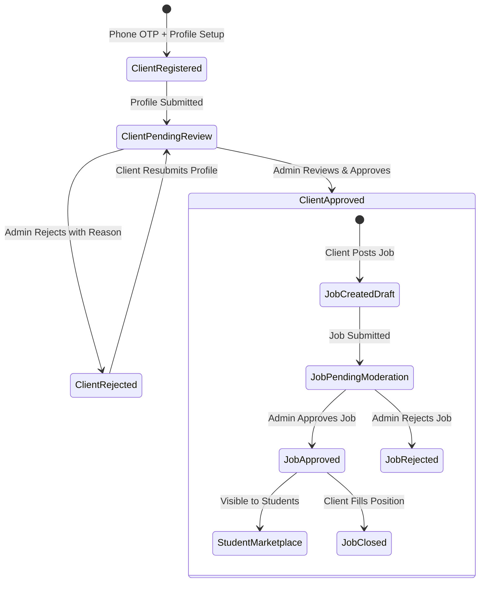

# TECH2PLACE Architecture Guide

This document defines the technical architecture, data contracts, security boundaries, and cross-application workflows powering the TECH2PLACE React Native ecosystem.

---

## 1. High-Level Architecture

```
                             ┌──────────────────────────────────────┐
                             │       Google Firebase Platform       │
                             │  (Auth, Firestore, Cloud Functions, │
                             │      FCM, Storage, Analytics)       │
                             └──────────────────┬───────────────────┘
                                                │
                 ┌──────────────────────────────┼──────────────────────────────┐
                 ▼                              ▼                              ▼
    ┌─────────────────────────┐    ┌─────────────────────────┐    ┌─────────────────────────┐
    │     STUDENT APP         │    │       CLIENT APP        │    │       ADMIN APP         │
    │ (com.tech2place.student)│    │ (com.tech2place.client) │    │  (com.tech2place.admin) │
    │                         │    │                         │    │                         │
    │ • Minor/Major Projects  │    │ • Employer Registration │    │ • Client Verifications  │
    │ • Approved Jobs Board   │    │ • Job Creation & Edit   │    │ • Job Moderation Board  │
    │ • Job Applications      │    │ • Applicant Pipeline    │    │ • User & Staff RBAC     │
    │ • Courses & Enrollment  │    │ • Company Profile       │    │ • App Version Policies  │
    │ • Force Update Gate     │    │ • Approval Status Gate  │    │ • Push Broadcaster      │
    └────────────┬────────────┘    └────────────┬────────────┘    └────────────┬────────────┘
                 │                              │                              │
                 └──────────────────────────────┼──────────────────────────────┘
                                                ▼
                             ┌──────────────────────────────────────┐
                             │          @tech2place/shared          │
                             │  (Types, Utilities, Theme, Services,│
                             │      Design System UI Components)    │
                             └──────────────────────────────────────┘
```

---

## 2. Monorepo Organization

```text
├── admin/                         # Administrative Console (React Native Android)
│   ├── android/                   # Native Android configuration (com.tech2place.admin)
│   ├── src/
│   │   ├── screens/               # Dashboard, Approvals, Users, Versions, Push, Staff, Audit
│   │   ├── services/              # Admin state & API adapters
│   │   └── App.tsx                # App entrypoint with RBAC routing
│   └── package.json
│
├── client/                        # Client / Employer App (React Native Android)
│   ├── android/                   # Native Android configuration (com.tech2place.client)
│   ├── src/
│   │   ├── screens/               # Auth, Profile, Job creation, Applicant management
│   │   ├── services/              # Client API adapters
│   │   └── App.tsx                # App entrypoint with approval state guard
│   └── package.json
│
├── student/                       # Student Mobile App (React Native Android)
│   ├── android/                   # Native Android configuration (com.tech2place.student)
│   ├── src/
│   │   ├── screens/               # Dashboard, Projects, Jobs, Applications, Courses, Profile
│   │   ├── services/              # Student API adapters
│   │   └── App.tsx                # App entrypoint with Force Update guard
│   └── package.json
│
├── shared/                        # Shared TypeScript Library
│   ├── components/                # Reusable cross-platform UI components (Button, Card, Modal, etc.)
│   ├── constants/                 # Collections, Roles, Config
│   ├── services/                  # Version check, Auth, Audit, Notifications, RBAC
│   ├── theme/                     # Brand colors (#026fc7/#0c8ce9), typography, spacing
│   ├── types/                     # Core domain interfaces
│   └── utils/                     # Semver parser, formatters, phone validators, deep linking
│
├── firebase/                      # Production Cloud Configurations
│   ├── firestore.rules            # Security rules with strict RBAC enforcement
│   ├── storage.rules              # Upload constraints (5MB avatar, 10MB attachments)
│   ├── firestore.indexes.json     # Compound query indexes
│   └── functions/                 # TypeScript background triggers & notification dispatch
│
└── tests/                         # Automated unit & integration tests
```

---

## 3. Core Domain Entities

### `User`
```typescript
interface User {
  uid: string;
  phoneNumber: string;
  name: string;
  role: 'student' | 'client' | 'moderator' | 'admin' | 'superuser';
  status: 'active' | 'suspended';
  isApproved: boolean;
  email?: string;
  profileImage?: string;
  createdAt: string;
  updatedAt: string;
}
```

### `Job`
```typescript
interface Job {
  id: string;
  clientId: string;
  clientName: string;
  title: string;
  description: string;
  category: string;
  skills: string[];
  budget: number;
  deadline: string;
  location: string;
  isRemote: boolean;
  jobType: 'Full-time' | 'Part-time' | 'Internship' | 'Contract';
  attachments: string[];
  status: 'pending_approval' | 'approved' | 'rejected' | 'closed';
  approvalStatus: 'pending' | 'approved' | 'rejected';
  rejectionReason?: string;
  approvedBy?: string;
  approvedAt?: string;
  applicationsCount: number;
  createdAt: string;
  updatedAt: string;
}
```

### `AppVersionConfig`
```typescript
interface AppVersionConfig {
  appId: 'student' | 'client' | 'admin';
  latestVersion: string;          // e.g. "1.1.0"
  minimumVersion: string;         // e.g. "1.0.0"
  updateMode: 'force' | 'flexible' | 'optional';
  updateTitle: string;
  updateMessage: string;
  androidStoreUrl: string;
  maintenance: boolean;
  maintenanceMessage?: string;
  enabled: boolean;
  updatedAt: string;
  updatedBy: string;
}
```

---

## 4. Key Workflows & State Machines

### 4.1 Client Verification & Job Posting Pipeline


### 4.2 Semantic Versioning & Force Update Gate


---

## 5. Deep Linking Scheme

All three applications register deep links matching the standard schema:
```text
tech2place://{appId}/{resource}/{id}
```

| Application | Scheme / Host | Target Destinations |
|:---|:---|:---|
| **Student** | `tech2place://student/jobs/:id` | Opens Job Detail screen directly |
| **Student** | `tech2place://student/projects/:id` | Opens Academic Project screen |
| **Client** | `tech2place://client/jobs/:id/applications` | Opens Candidate Review board |
| **Admin** | `tech2place://admin/approvals/clients` | Opens Pending Clients review screen |
| **Admin** | `tech2place://admin/approvals/jobs` | Opens Pending Jobs moderation screen |
